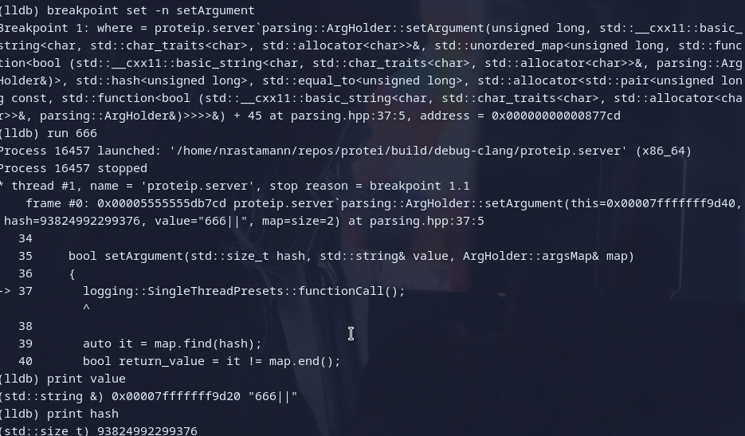

# Практика протей
Статус задач:
- [x] Задача №1
- [x] Задача №2
- [x] Задача №3
- [x] Задача №4
- [x] Задача №5
- [x] Задача №6
- [x] Задача №7
## Описание
Программа для выполнения практики. Минимальный стандарт - C++23, минимальные 
версии компиляторов - gcc 13.1 и clang 17.0.1

### Вызов программ
```sh
proteip [-a address port] [-L folder] [-r role_name] [-i index] [-h] - клиент
proteip.server [-p port] [-h] - Сервер
proteip.benchmark - гугл бенчмарки
ctest --<preset_name> - клиент
multithread.sh [-a server_address] [-p server_port] [-N number_of_clients] [-n number_of_waves] [-t test_log_directory] [-B binary_directory] [-c commands_file]
```

### Функционал клиента
Программа выполняет следующие функции:
- Принимает на вход порт, адрес (в шестнадцетеричной системе 
счисления или в десятичной, через точку, пробел и любой символ кроме цифр и 
символов шестнадцетеричной системы счисления), путь к файлу, роль и индекс и сохраняет их в специализированном объекте
- Введенные пути к файлам и адреса проверяются на валидность через функциональные объекты типов
ConnectionTest и ResourceTest (вызов оператора () внутри объекта AppSettings).
- Подключено логирование в файл, поддержаны разные уровни логирования, поддержана работа с многопоточностью
- Доступен ввод имени пользователя
- Доступен ввод типа четырхмерного вектора (поддерживаемые типы - std::string, 
char, bool, float, double, int, uint8_t, uint16_t, uint32_t, uint64_t, int8_t, int16_t, 
int32_t, int64_t).
- Доступна возможность опустошить заполненную очередь четырехмерных векторов и 
вывести в терминал.
- Доступна возможность напечатать первый элемент очереди векторов.
- Доступен вывод текущих настроек.
- Возможность отправить всем серверам, которые были переданы при запуске первый вектор 
- Вывод помощи через флаг -h в консоль
в очереди и получить от серверов измененный вектор обратно в конец очереди.

### Функционал сервера
Программа выполняет следующие функции:
- Принимает на вход порт, без него не запускается
- Подключено логирование в файл, поддержаны разные уровни логирования, поддержана работа с многопоточностью
- Вывод помощи через флаг -h в консоль
- Над полученными данными совершается работа по следующим принципам:
- Целочисленные данные, в вектор записываются 4 новых значения по принципу:
    - {vec[0]+vec[0], vec[0]-vec[1], vec[0] * vec[2], vec[0] / vec[3]} с учетом деления на 0
    - Числа с плавающей точкой, в вектор записываются 4 новых значения по принципу -
    - {vec[0]+vec[0], vec[0]-vec[1], vec[0] * vec[2], vec[0] / vec[3]} без учета
                деления на 0(могут быть NaN/Inf)
    - Булевые значения, в вектор записываются 4 новых значения по принципу -
                {vec[0]||vec[0], vec[0]&&vec[1], !vec[0] || !vec[2], !vec[0] && !vec[3]}
    - Строковые данные - к каждой строке применяется функция toupper

### Функционал multithread.sh
Программа выполняет следующие функции:
- Принимает на вход набор флагов
- Скрипт эмулирует n*N пользователей, которые выполняют набор операций в клиенте.
- Скрипт создан для проверки работы мультипоточности сервера, как побочный эффект,
с помощью скрипта можно эмулировать любые команды клиенту. Скрипту необходимо указать 
директорию с бинарником. Команды в файле, путь к которому указывается через -t, 
соответствуют командам в клиенте.

## Критичные аргументы
В проекте присутствует ряд критических аргументов, которые в дальнейшей разработке 
будут использоваться кодом программы и будут критичными для ее работы, а именно 

- IP адрес 
- порт 

Также существует ряд критических ошибок, из-за которых программа имеет право закончить работу:
- Передан флаг, которого нет в созданных флагах
- Ошибка при парсинге аргументов коммандной строки
- Переданные библиотеки и адреса с портами не доступны

## Логирование 
Проект имеет систему логирования, при запуске будет создана папка logs, где можно
будет ознакомиться с логами в формате
\[\<Дата\> \<Текущее время\>\]: \<Уровень логирования\> \[\<Номер потока\>\ : \<Путь до файла\> : \<Функция, в которой вызван лог\>] | \<Текст сообщения\>:

```sh
[2026-03-09 12:30:14.963805072]: <Trace> [139832203650944 : /home/nrastamann/repos/protei/src/parsing.cpp : std::expected<CommandLineArgsHolder, ParseResult> parsing_protei::parseClArgs(std::span<std::string>) : 76] | Function called
[2026-03-09 12:30:14.964188333]: <Info> [139832203650944 : /home/nrastamann/repos/protei/src/main.cpp : int main(int, char **) : 33] | Starting AppSettings creation
```

TODO: добавить уровень логирования как флаг

Доступны следующие уровни логирования:
- Error - ошибки 
- Warning - предупреждения, возможно некорректное поведение
- Info - информационные сообщения
- Debug - сообщения для будующего дебагга
- Trace - полный набор информации по логированию, включая порядок вызова функций

## Пресеты
Проект для сборки имеет систему пресетов:
- Сначала есть 3 основных типа конфигурации:
    - Debug - Дебаг сборка, с флагом оптимизации -O1
    - DebugSan - Дебаг сборка, с включенными санитайзерами
    - Release - Релиз сборка с флагом оптимизации -O3
- Далее для каждого из этих типов созданы 2 публичных пресета:
    - clang-версия
    - gcc-версия

Итого 6 пресетов конфигурации:
- "debug-san-gcc"   - DebugSan-gcc
-  "debug-san-clang" - DebugSan-clang
-  "debug-gcc"       - Debug-gcc
-  "debug-clang"     - Debug-clang
-  "release-gcc"     - Release-gcc
-  "release-clang"   - Release-clang

Также есть билд пресеты, которые дублируют пресеты конфигурации, но также имеют 2 дополнительных:

Билд пресеты определяют то, какие таргеты будут собраны, таким образом есть 3 основных типа сборки:
- _debug - сборка клиента, сервера и тестов - это debug и debug-san конфигурационные пресеты
- _source_only - сборка клиента и сервера - release конфигурационные пресеты
- _full - сборка клиента, сервера, тестов, бенчмарка - release конфигурационные пресеты - 
перезапишут папку и сбилдят все таргеты в папке release-\<preset_name\>

Аналогично есть по 2 пресета на компилятор, итого 8 пресетов:

- "debug-san-gcc"   - DebugSan-gcc 
-  "debug-san-clang" - DebugSan-clang
-  "debug-gcc"       - Debug-gcc
-  "debug-clang"     - Debug-clang
-  "release-gcc"     - Release-gcc
-  "release-clang"   - Release-clang
-  "full-gcc"        - Full-project-gcc (будет собираться в папке release-gcc, конфигурационный пресет release-gcc)
-  "full-clang"      - Full-project-clang (будет собираться в папке release-clang, конфигурационный пресет release-clang)

### Сборка
Чтобы собрать проект, можно использовать следующий набор команд:
```sh
cd protei
cmake --preset <PresetName>
cmake --build --preset <PresetName>
```

В результате собранный проект будет находиться в папке **build/<PresetName>/proteip**

Например 2 ситуации:
- Сборка release со всеми таргетами (full build-preset) с компилятором clang:
```sh
cd protei
cmake --preset release-clang
cmake --build --preset full-clang
```
Используется **Конфигурационный** пресет **release-clang**, собирается **full-clang**

- Сборка debug-san с компилятором gcc:
```sh
cd protei
cmake --preset debug-san-gcc
cmake --build --preset debug-san-gcc
```

## Санитайзеры
Чтобы получить сборку с санитайзерами можно или установить переменную SANITIZERS во время сборки
в ON или воспользоваться системой пресетов и собрать пресет DebugSan.

Работа санитайзеров продемонстрирована на скриншотах


## Статический анализатор
Статический анализатор подключен к процессу компиляции на конфигурациях debug-san и debug, 
но также им можно воспользоваться напрямую:


## Дебаггинг

Для дебагга используется lldb - clang-овский вариант дебаггера с расширенными 
возможностями относительно gdb:


## Тесты
Проект имеет тесты, которые покрывают часть проекта, для запуска можно воспользоваться командой:

```sh
ctest --preset \<Current-preset\>
```

Тесты есть в следующих пресетах:
- "debug-san-gcc"   - DebugSan-gcc 
-  "debug-san-clang" - DebugSan-clang
-  "debug-gcc"       - Debug-gcc
-  "debug-clang"     - Debug-clang
-  "full-gcc"        - Full-project-gcc (будет собираться в папке release-gcc, конфигурационный пресет release-gcc)
-  "full-clang"      - Full-project-clang (будет собираться в папке release-clang, конфигурационный пресет release-clang)

Результаты покрытия тестами на одном из билдов:


## Зависимости
Единственной обязательной зависимостью на данный момент является googletest, также
будут добавлены в последствии googlebenchmark и библиотека для формирования json-а для
отправки вектора на сервер.
