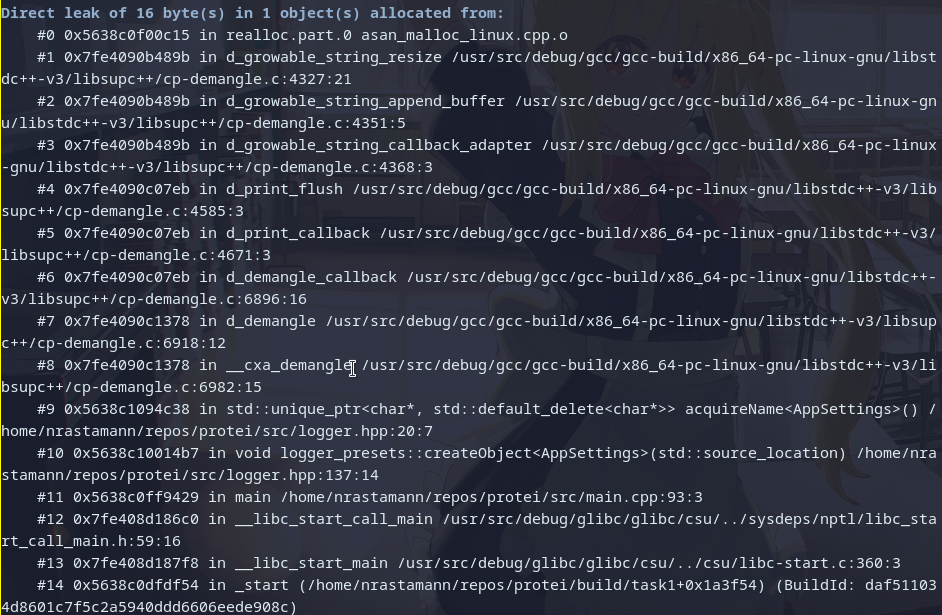
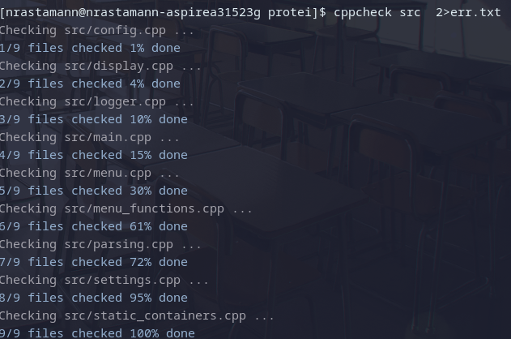
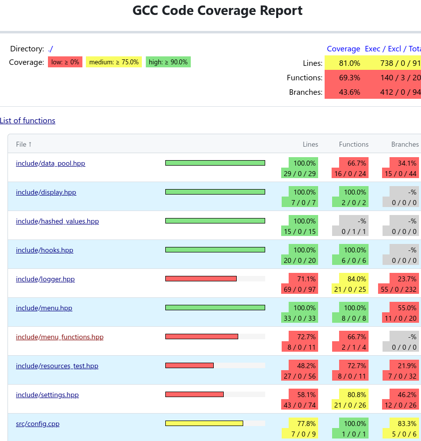

# Практика протей
Статус задач:
- [x] Задача №1
- [x] Задача №2
- [x] Задача №3
- [x] Задача №4
     
## Критичные аргументы
В проекте присутствует ряд критических аргументов, которые в дальнейшей разработке 
будут использоваться кодом программы и будут критичными для ее работы, а именно 

- IP адрес 
- порт 
- пути до библиотек
- также при создании системы ролей важной окажется переданная роль. 

Также существует ряд критических ошибок, из-за которых программа имеет право закончить работу:
- Передан флаг, которого нет в созданных флагах
- Ошибка при парсинге аргументов коммандной строки
- Переданные библиотеки и адреса с портами не доступны

## Логирование 
Проект имеет систему логирования, при запуске будет создана папка logs, где можно
будет ознакомиться с логами в формате
\[\<Дата\> \<Текущее время\>\]: \<Уровень логирования\> \[\<Номер потока\>\ : \<Путь до файла\> : \<Функция, в которой вызван лог\>] | \<Текст сообщения\>:

```sh
[2026-03-09 12:30:14.963805072]: <Trace> [139832203650944 : /home/nrastamann/repos/protei/src/parsing.cpp : std::expected<CommandLineArgsHolder, ParseResult> parsing_protei::parseClArgs(std::span<std::string>) : 76] | Function called
[2026-03-09 12:30:14.964188333]: <Info> [139832203650944 : /home/nrastamann/repos/protei/src/main.cpp : int main(int, char **) : 33] | Starting AppSettings creation
```

Уровень логирования можно изменить при настройке CMake, указав значение 
переменной -DLOG_VERBOSITY значениями:
- Error - ошибки 
- Warning - предупреждения, возможно некорректное поведение
- Info - информационные сообщения
- Debug - сообщения для будующего дебагга
- Trace - полный набор информации по логированию, включая порядок вызова функций

## Пресеты
Проект имеет систему пресетов, которая поддерживает 3 конфигурации сборки:

- Debug - Дебаг сборка, с флагом оптимизации -O1
- DebugSan - Дебаг сборка, с включенными санитайзерами
- Release - Релиз сборка с флагом оптимизации -O3

## Санитайзеры
Работа санитайзеров продемонстрирована на скриншотах



## Статический анализатор
Статический анализатор подключен к процессу компиляции, но также им можно воспользоваться напрямую:


## Тесты
Проект при каждом пресете собирает тесты, которые покрывают значительную часть
проекта, для запуска можно воспользоваться командой:

```sh
ctest --preset \<Current-preset\>
```

При необходимости получить уровень покрытия, можно воспользоваться следующим набором команд:
```sh
cmake --build --preset \<Current-preset\> -j

ctest --preset \<Current-preset\> -j

gcovr --gcov-executable "llvm-cov gcov" --filter src/ --filter include/ --html-details coverage/gcovr.html
```
Пример результатов работы gcovr:



